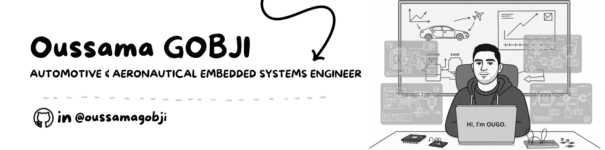

  

<h1 align="center">🧑🏻‍💻 Oussama Gobji</h1>
<h3 align="center">M2 Automotive & Aeronautical Engineering Student | Embedded Systems, IoT & Software Development</h3>

---

## 👨‍💻 About Me

I hold a Bachelor's degree in Computer Systems Engineering and am currently pursuing an M2 Professional Master’s in Automotive & Aeronautical Engineering, specializing in Embedded Systems, IoT, and software development with expertise in Python, C/C++, and STM32.  

My focus is on designing innovative digital and IoT solutions that bridge software and hardware. My ability to quickly master new technologies and adapt to fast-evolving industrial environments drives my passion for innovation in automotive, aeronautical, and tech-driven industries.

On my GitHub, you will find a collection of projects that I have designed and implemented from concept to deployment, demonstrating my ability to transform ideas into practical and scalable solutions.

In addition to development, I have experience managing projects as a Product Owner, ensuring that each solution meets technical requirements while staying aligned with real-world needs.

I am also an IEEE member and co-founder of the ISETN Community, where I contribute to knowledge sharing and collaborative initiatives, passionate about innovation, technology, and continuous learning.

Feel free to connect with me on LinkedIn to discuss opportunities, collaborations, or technical projects.

---

## 💡 Skills & Tools

  <!-- Programming Languages -->
  
  
  
  
  
  <!-- Embedded & IoT -->
  
  
  
  
  <!-- Automotive & Aeronautical Skills -->
  
  
  
  
  
  <!-- Communication Protocols -->
  
  
  
  
  
  
  
  
  
  <!-- Web & Tools -->
  
  
  
  
  
  
  
  
  

